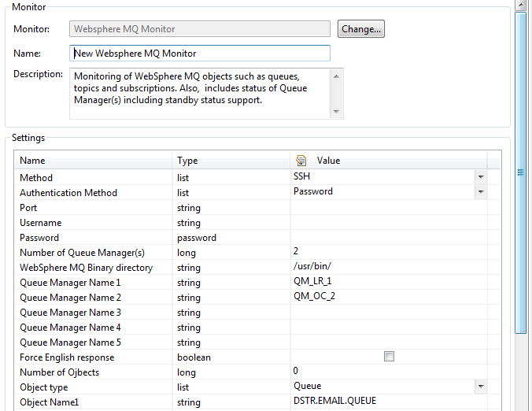

# WebSphere MQ Monitoring Plugin

## Overview

 The WebSphere MQ Monitoring plugin enables you to monitor your queues and topics and
relate these metrics to your applications overall performance.

With this plugin you can monitor a WebSphere MQ QueueManager, its Queues, Topics and Subscriptions.  
**This plugin is also included in our** **[WebSphere MQ Monitoring Fastpack](https://github.com/dynaTrace/Dynatrace-WebSphere-MQ-Monitoring-Fastpack)****, augmented by dashboards and a template system profile!**

## Plugin Details

| Name | WebSphere MQ Monitoring Plugin
| :--- | :---
| Author | Alain Helaili (alain.helaili@dynatrace.com)
| Supported dynTrace Versions | >= 5.5  
| | Asad Ali (asad.ali@dynatrace.com)
| License | [dynaTrace BSD](dynaTraceBSD.txt)
| Support | [Not Supported ](https://community.compuwareapm.com/community/display/DL/Support+Levels#SupportLevels-Community)
| Release History | 2010-05-05 Initial Release  
| | 2012-03-09 v1.0.7 (SSH) released  
| | 2012-04-02 v2.0.0 (combined SSH with non)
| Download | [WebSphere MQ Monitoring Plugin 2.0.0](com.dynatrace.plugins.mq_2.0.0.jar)

## Provided Measures

### WebSphere MQ Queue Manager

  * Status  
provides the status of the Queue Manager as a numeric value  
0: ENDED UNEXPECTEDLY  
1: ENDED_PREEMPTIVELY  
2: ENDED_IMMEDIATELY  
3: ENDED_NORMALLY  
4: ENDING_PREEMPTIVELY  
5: ENDING_IMMEDIATELY  
6: QUIESCING  
7: STARTING  
8: RUNNING

  * Running  
Is 1 only if the QueueManager is in Running state. If it is ended,starting or in the processes of shutting down it will be 0

  * Stopped  
Is 1 only if the QueueManager is in ended. If it is running, starting or in the processes of shutting down it will be 0

### WebSphere MQ Queue

  * Queue depth  
The current depth of the queue, in other words how many messages are currently on it

  * Duration since last read  
The duration in seconds since the last message was read (removed) from the queue.  
This measure will only be available if MONQ is enabled via: ALTER QMGR MONQ(LOW)

  * Duration since last insert  
The duration in seconds since the last message was put onto the queue  
This measure will only be available if MONQ is enabled via: ALTER QMGR MONQ(LOW)

  * Oldest message age  
The age in seconds of the oldest message on the queue

  * Input handle count  
This is the number of applications that are currently connected to the queue to put messages on the queue.

  * Output handle count  
This is the number of applications that are currently connected to the queue to get messages from the queue.

### WebSphere MQ Topic

  * Publisher Count  
The number of applications currently publishing to the topic.

  * Subscriber Count  
This is the number of subscribers for this topic string, including durable subscribers who are not currently connected.

### WebSphere MQ Subscriptions

  * Message count  
The number of messages that went through

  * Duration since last restoration  
Elapsed time in seconds since the last restoration of the connection.

  * Duration since last message  
Elapsed time in seconds since the last message was retrieved

## Configuration

You need to setup a Monitor in your System Profile.  

Configure the authentication method, port, and user credentials to access your WebSphere MQ installation and configure the MQ Bin directory.

Next configure the type of Object that you want to monitor (Queue, Topic, Subscription) and the Queue Managers to use. As a last item configure the object name appropriately. If you select object type
Queue than this is the queue name, if you select a topic than this is the topic string of your topic.  
As a note the Queue manager name and the queue name are both case sensitive!

**IMPORTANT** : The user used to run the dynaTrace collector (which the plugin is being executed on) needs to have sufficient privileges from a MQ point of view. If the queue manager status is ok but all numeric values are null, it is likely that the user does not have enough privileges. 

## Configuration of MQ

### Language

WebSphere MQ reports its status in the users own language. While this is convenient for the user it is a problem for this plugin. If you are using 7.0.1 or higher you should use the _Force English
response_ option to work around this. If your WebSphere MQ installation is older than that please make sure that the user running the collector and MQ has its language set to English.

### MQ Statistics

To get the full value of this plugin your need to enable monitoring either globally at the Queue Manager level or locally at the Queue level. To enable monitoring at the Queue Manager level, execute
the following MQSC command in your MQ console:

    
    
    ALTER QMGR MONQ(LOW)

or from a regular Unix/Windows shell :

    
    
    echo ALTER QMGR MONQ(LOW) | runmqsc

it will enable some additional statistic values that would otherwise not be available.

## Installation

Import the Plugin into the dynaTrace Server. For details how to do this please refer to the [dynaTrace documentation](https://community.compuwareapm.com/community/display/DOCDT55/Plugin+Management).  
Next import the two Dashboards attached to this page, they will give you a good starting point.

